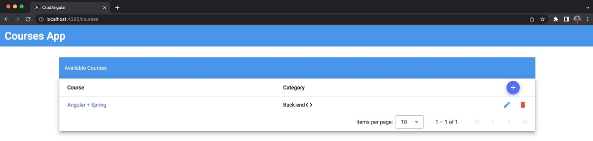
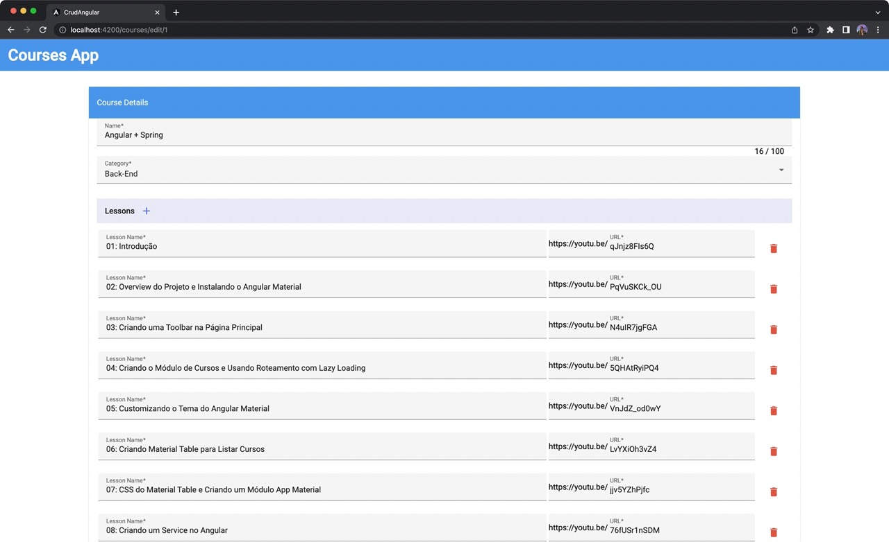
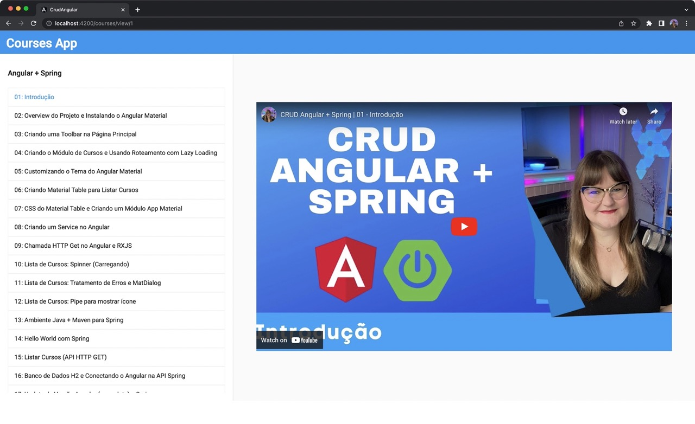

# REST API with Spring Boot and Angular


CRUD Angular + Spring demonstrating Has-Many relationship, with tests.

This API is to showcase, especially for beginners, what a basic CRUD API that's close to being Production-ready looks like.

## 💻 Tecnologies

- Java 25
- Spring Boot 4 (Spring 7)
- Maven
- JPA + Hibernate
- MySQL
- JUnit 5 + Mockito (back-end tests)
- Testcontainers (back-end integration tests)
- Angular v22
- Angular Material
- Karma + Jasmine (front-end tests)

## ⌨️ Editor / IDE

- Visual Studio Code
- Java Extensions [link](https://marketplace.visualstudio.com/items?itemName=loiane.java-spring-extension-pack)
- Angular Extensions [link](https://marketplace.visualstudio.com/items?itemName=loiane.angular-extension-pack)

## Some functionalities available in the API

- ✅ Java model class with validation
- ✅ JPA repository
- ✅ JPA Pagination
- ✅ MySQL database (you can use any database of your preference)
- ✅ Controller, Service, and Repository layers
- ✅ Has-Many relationships (Course-Lessons)
- ✅ Java Records as DTO (Data Transfer Object)
- ✅ Hibernate / Jakarta Validation, including custom validators
- ✅ Unique course name enforcement (service check + database constraint)
- ✅ Soft delete (deleted courses are marked inactive, not removed)
- ✅ Transactional service layer (Open Session in View disabled)
- ✅ Consistent error responses with RFC 7807 Problem Details
- ✅ Unit tests for all layers (repository, service, controller)
- ✅ Integration tests with Testcontainers (real MySQL in Docker)
- ✅ Test coverage reports with JaCoCo
- ✅ Spring Docs - Swagger UI ([springdoc.org](https://springdoc.org/))

### Not implemented (maybe in a future version)

- Security (Authorization and Authentication)
- Caching
- Data Compression
- Throttling e Rate-limiting
- Profiling the app
- Docker Build

## Some functionalities available in the front end

- ✅ Angular Standalone components
- ✅ Angular Signals (`signal`, `computed`, `httpResource`)
- ✅ Zoneless change detection (Angular v22 default)
- ✅ Built-in control flow (`@if`, `@for`)
- ✅ Lazy loading with `loadComponent` routes
- ✅ Angular Material components
- ✅ List of all courses with pagination
- ✅ Form to update/create courses with lessons (has-many)
- ✅ View only screen
- ✅ Signal Forms (`form`, `FormField` - stable in Angular v22)
- ✅ Presentational x Smart Components
- ✅ Unit and Integration tests for components, services, pipes, guards

## Screenshots

Main Page with Pagination

<p align="center">
  
</p>

Form with One to Many (Course-Lessons)

<p align="center">
  
</p>

View Page with YouTube Player

<p align="center">
  
</p>

## ❗️Executing the code locally

### Executing the back-end

You need to have Java and Maven installed and configured locally.

Open the `crud-spring` project in your favorite IDE as a Maven project and execute it as Spring Boot application.

Once running, the API docs are available at **<http://localhost:8080/swagger-ui.html>**.

#### Using MySQL (dev profile)

To run against MySQL instead, start the database with Docker (also starts phpMyAdmin on port 8081):

```
cd crud-spring
docker compose up -d
```

Then run the app with the `dev` profile. The connection can be customized with the `MYSQL_HOST`, `MYSQL_USER` and `MYSQL_PASSWORD` environment variables (in the `prod` profile, the credentials are required). The `dev` profile preserves data between restarts; to seed a fresh database, run `src/main/resources/schema.sql` manually.

#### Back-end tests

```
cd crud-spring
./mvnw test
```

Unit tests run in-memory; the integration tests use Testcontainers and require Docker to be running.

### Executing the front-end

You need to have Node.js / NPM installed locally.

1. Install all the required dependencies:

```
npm install
```

2. Execute the project:

```
npm run start
```

This command will run the Angular project with a proxy to the Java server, without requiring CORS.

Open your browser and access **http://localhost:4200** (Angular default port).

#### Upgrading Angular

```
ng update
```

Then

```
ng update @angular/cli @angular/core @angular/cdk @angular/material @angular/youtube-player --force
```
